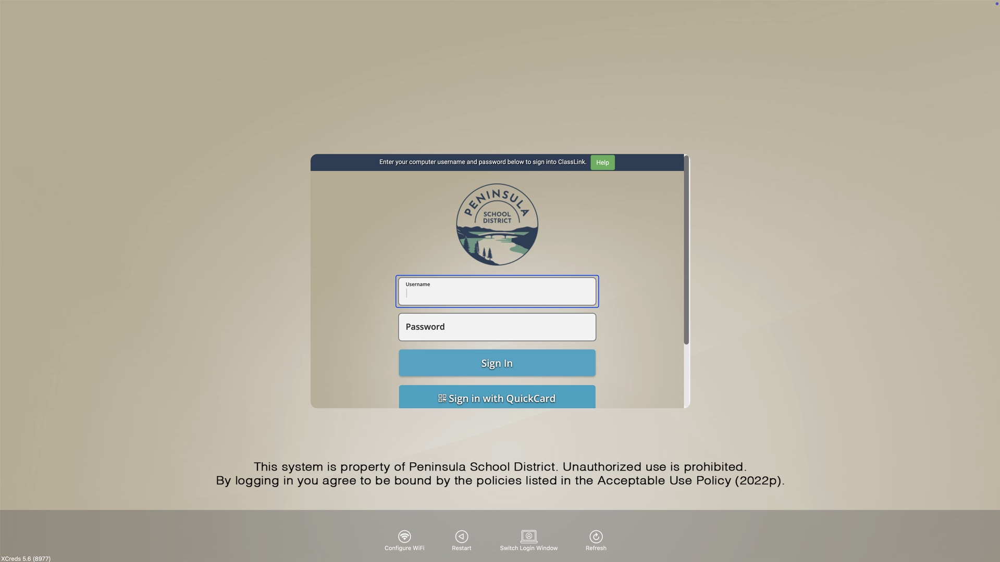

# XCreds ClassLink Tenant Patch

A modification to [XCreds](https://github.com/twocanoes/xcreds) (v5.6) that makes ClassLink work properly as an OIDC identity provider for macOS login.

*ClassLink tenant login screen running at the macOS login window via XCreds.*

## The Problem

ClassLink's OIDC/OAuth2 implementation always redirects users to a generic "Find your login page" screen at `launchpad.classlink.com`, regardless of how you configure things. Users have to search for and select their district before they can log in.

I opened a case with ClassLink about this (Case #00606606). Their response:

> "The redirect to the generic ClassLink page is intended with the OIDC/OAuth2 workflow. The reason being is this will allow for universal functionality. Unfortunately we cannot manipulate the issuer url to redirect to [your] login page. If JAMF Connect supports a SAML integration, this can be specified in the ClassLink SAML settings."

Neither Jamf Connect nor XCreds use SAML for login window auth - they use OIDC. So this is a dead end on ClassLink's side. I submitted feature requests to both [ClassLink](https://help.classlink.com) and [Jamf](https://ideas.jamf.com/ideas/ID-I-391), but as of early 2026 neither has addressed it.

This can't be fixed with configuration in Jamf Connect or stock XCreds. It requires modifying the source code that handles the webview navigation during login.

## The Solution

This patch modifies one file in the XCreds source - `WebViewController.swift` - to add two things:

### 1. Redirect Interceptor

ClassLink redirects back to your configured `redirectURI` after authentication with the authorization code in the URL. Without this patch, the webview tries to load whatever that redirect target is (your school website, localhost, etc.). The interceptor catches this redirect, cancels the navigation, extracts the auth code, and exchanges it for tokens through the normal OIDC flow. The user sees a clean "Signing in..." message during the exchange.

### 2. Tenant Auto-Navigation

When ClassLink loads the generic search page, JavaScript is injected that:
- Shows a white overlay with a spinner ("Loading YourDistrict login...")
- Programmatically searches for your tenant code in ClassLink's search bar
- Clicks the matching result
- Your district's actual login page loads underneath

The user never sees the generic search page. They just see a brief loading spinner, then their district's ClassLink login screen.

## Configuration

This patch adds two custom preference keys (set via MDM profile alongside your other XCreds preferences):

| Key | Type | Required | Description |
|-----|------|----------|-------------|
| `classLinkTenant` | String | Yes | Your ClassLink tenant code. This is the slug after `launchpad.classlink.com/` in your district's login URL. For example, if your login page is `launchpad.classlink.com/mydistrict`, set this to `mydistrict`. |
| `classLinkTenantDisplayName` | String | No | Friendly name shown on the loading overlay. Defaults to the tenant code if not set. Example: `My School District` |

### Standard XCreds keys you'll also need

These are standard XCreds preferences, not specific to this patch:

| Key | Value |
|-----|-------|
| `discoveryURL` | `https://launchpad.classlink.com/.well-known/openid-configuration` |
| `clientID` | Your ClassLink OIDC Client ID (from ClassLink Developer portal) |
| `clientSecret` | Your ClassLink OIDC Client Secret |
| `redirectURI` | The redirect URI configured in your ClassLink app (this is what the interceptor catches) |
| `idpHostName` | Set to `launchpad.classlink.com` so password scraping works on the ClassLink login page |

### A note about the redirect URI

This one is a little weird. ClassLink requires your redirect URI's domain to be a verified domain in their Developer portal. We couldn't get `localhost` or `127.0.0.1` to work reliably as a verified domain for the redirect, so we ended up using our school's homepage URL (`https://www.yourschool.org/`).

This sounds wrong but it's fine - the redirect interceptor in this patch catches the redirect **before** the browser actually makes a request to that URL. ClassLink appends the authorization code to the redirect URI (`https://www.yourschool.org/?code=abc123`), the interceptor sees it match, cancels the navigation, and pulls the code out. Your school's website never actually loads and never sees the auth code.

Just make sure the `redirectURI` in your XCreds config profile matches exactly what you have set in your ClassLink Developer app settings.

### ClassLink Developer Portal Setup

1. Create an OIDC application in the ClassLink Developer portal
2. Add your redirect URI domain as a verified domain (we used our school homepage - see note above)
3. Set the redirect URI to match what you'll put in the XCreds config profile
4. Note your Client ID and Client Secret

See `example-classlink.mobileconfig` in this repo for a complete example configuration profile.

## How to Use

1. Get the XCreds v5.6 source code from the [XCreds GitHub repo](https://github.com/twocanoes/xcreds)
2. Replace `XCreds/WebViewController.swift` with the version from this repo
3. Compile and sign with your Apple Developer certificate
4. Deploy with the preference keys above via your MDM

You need to be comfortable building Xcode projects. If you're K-12 education, the $99/year Apple Developer Program fee is waived.

## Limitations

- **Fragile to ClassLink UI changes.** The JavaScript targets specific CSS selectors on ClassLink's login page (`.search-bar-input`, `.dropdown-list-item`, `button[data-code="..."]`). If ClassLink redesigns their page, the auto-navigation will break. There's a 5-second timeout that removes the overlay if the script fails, so it degrades to showing the generic search page (same as without the patch).

- **No automatic updates.** You're compiling XCreds yourself, so you need to manually check for new XCreds releases and re-apply this patch.

- **Based on XCreds v5.6.** Newer versions may have changes to WebViewController.swift that require merging.

## Password Handling

XCreds captures the password from the ClassLink login form at each login and sets the local account password to match. There's no ongoing real-time password sync while the user is logged in - the local password updates the next time they log in. For shared labs and K-12 environments this is usually fine.

XCreds also has a `PasswordOverwriteSilent` preference key that can silently reset the keychain if the IdP password has changed since the last login - worth looking into if students forgetting their previous password is a headache for you.

## Credits

- [XCreds](https://github.com/twocanoes/xcreds) by Twocanoes Software (Timothy Perfitt)
- ClassLink integration by Brad White, Peninsula School District
